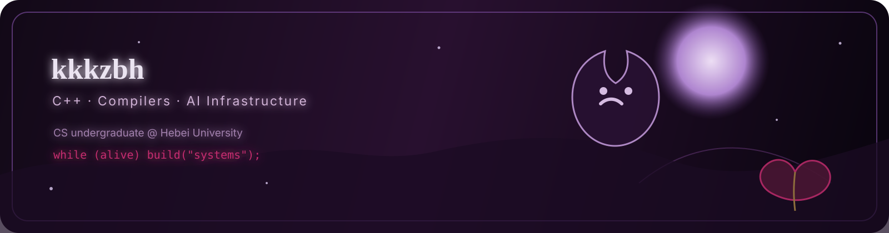
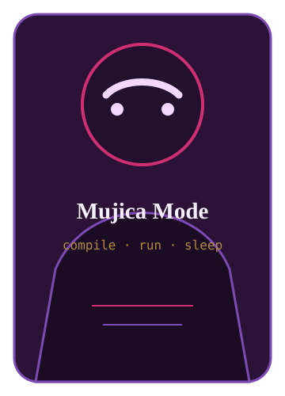

<p align="center">
  
</p>

<p align="center">
  
</p>

<h1 align="center">Hi, I'm kkkzbh ✦</h1>

<p align="center">
  CS undergraduate @ Hebei University<br/>
  C++ / Compilers / AI Infrastructure / Competitive Programming
</p>

<p align="center">
  
  
  
  
  
</p>

<p align="center">
  
</p>



### ✦ About me

- 🎓 CS undergraduate from **Hebei University**.
- 🧩 Interested in **C++**, **compilers**, **AI infrastructure**, and **ML systems**.
- 🛠️ Building projects around compiler design, CLion tooling, OS, and async C++ systems.
- 🏆 ICPC / CCPC participant.
- 🌙 Motto: `I want to sleep, but the compiler still has diagnostics.`

<br clear="right"/>

---

### ✦ Featured Projects

<table>
  <tr>
    <td width="50%" valign="top">
      <h3><a href="https://github.com/kkkzbh/KCP">KCP</a></h3>
      <p>C++26-inspired compiler prototype with preprocessing, parsing, semantic analysis, IR / LLVM codegen, modules, concepts, pattern matching and explicit borrow / move ideas.</p>
      <sub><b>Focus:</b> compiler frontend · language design · LLVM</sub>
    </td>
    <td width="50%" valign="top">
      <h3><a href="https://github.com/kkkzbh/CPH">CPH</a></h3>
      <p>A CLion plugin for competitive programming: sample generation, remote submission, run-configuration automation and workflow acceleration.</p>
      <sub><b>Focus:</b> Kotlin · JetBrains Platform · CP tooling</sub>
    </td>
  </tr>
  <tr>
    <td width="50%" valign="top">
      <h3><a href="https://github.com/kkkzbh/OS">OS</a></h3>
      <p>A toy x86/i386 operating system covering bootloader, paging, interrupts, scheduling, system calls, filesystem and networking experiments.</p>
      <sub><b>Focus:</b> kernel · low-level systems · x86</sub>
    </td>
    <td width="50%" valign="top">
      <h3><a href="https://github.com/kkkzbh/bigxin">bigxin</a></h3>
      <p>An IM/chat system built around C++, Boost.Asio coroutine networking, Qt/QML UI, MySQL and Redis.</p>
      <sub><b>Focus:</b> async C++ · distributed backend · Qt/QML</sub>
    </td>
  </tr>
  <tr>
    <td width="50%" valign="top">
      <h3><a href="https://github.com/kkkzbh/AscendAny">AscendAny</a></h3>
      <p>AI-assisted learning / competition scenario project, connecting data, personalized recommendation and conversational analysis.</p>
      <sub><b>Focus:</b> Python · AI application · agent workflow</sub>
    </td>
    <td width="50%" valign="top">
      <h3><a href="https://github.com/kkkzbh/fcitx5-theme-AveMujica">fcitx5-theme-AveMujica</a></h3>
      <p>A personal Fcitx5 theme experiment that brings Ave Mujica aesthetics into the Linux input-method experience.</p>
      <sub><b>Focus:</b> Linux desktop · theme design · Ave Mujica</sub>
    </td>
  </tr>
</table>

---

### ✦ Tech Stack

<table>
  <tr>
    <td><b>Systems</b></td>
    <td>C++20/23/26, Boost.Asio, coroutines, Qt/QML, Linux</td>
  </tr>
  <tr>
    <td><b>Compiler</b></td>
    <td>Lexer / parser / semantic analysis, IR design, LLVM codegen, diagnostics</td>
  </tr>
  <tr>
    <td><b>Backend</b></td>
    <td>MySQL, Redis, async services, session management, protocol design</td>
  </tr>
  <tr>
    <td><b>AI / Research</b></td>
    <td>PyTorch, lifelong person re-identification, AI infrastructure, ML systems</td>
  </tr>
</table>

---

### ✦ Current Focus

```cpp
while (alive) {
    learn("compiler");
    build("systems");
    train("models");
    sleep(false);
}
```

<p align="center">
  
</p>

<p align="center">
  
  
</p>

<p align="center">
  <sub>Dark, elegant, and still trying to pass all tests.</sub>
</p>
