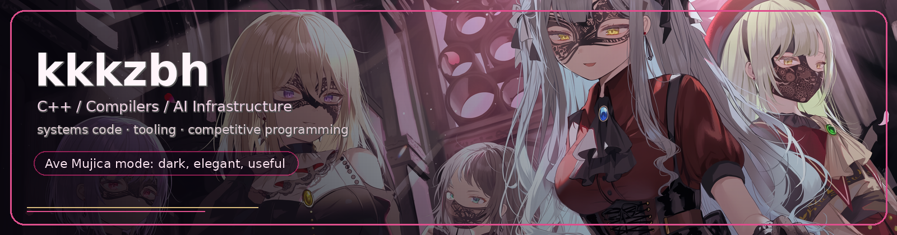
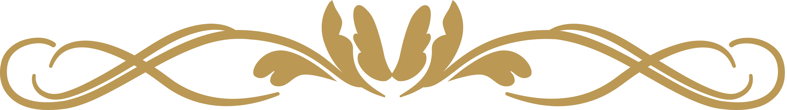
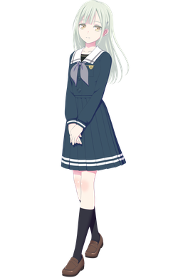
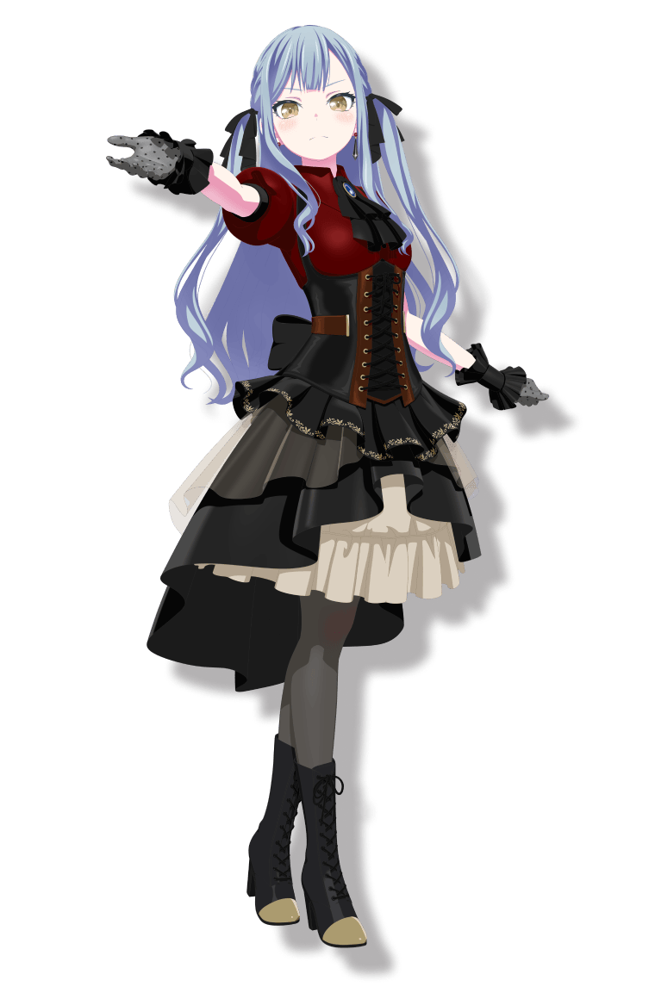
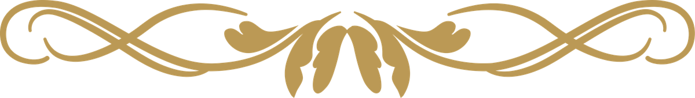

  

<h1 align="center">Hi, I'm kkkzbh ✦</h1>

  
  
  
  

  
  
  
  
  
  
  

  

## ✦ About me

* 🎓 CS undergraduate with a genuine love for computer science.
* 🧩 C++ enthusiast drawn to low-level systems, with hands-on experience in data structures, operating systems, TCP, and a compiler of my own.
* 🏆 Algorithmic problem-solving lover; **ICPC Invitational Bronze** medalist, **CCPC Invitational Silver** medalist, and **Provincial Gold** medalist.
* 🤖 Interested in both **AI / Agent systems** and **low-level engineering**, hoping to explore related research and engineering problems.
* 🌙 Motto: `I want to sleep, but the compiler still has diagnostics.`

 

---

## ✦ Current Focus

- 🧠 Advancing **KCP**, my C++26-inspired language/compiler prototype: diagnostics, stdlib formatting, IR/codegen, and miniC lab infrastructure.
- 🧭 Extending **KCP's CLion tooling**: PSI parsing, references, rename, completion, syntax highlighting, and editor workflow.
- 🚀 Maintaining **CPH Target Runner**, a CLion competitive-programming toolkit with sample management, Competitive Companion import, and Codeforces submission workflows.
- 🐧 Shipping **Codex tooling for Fedora KDE**: RPM/DNF packaging, CI and release automation, GitHub Pages repository metadata, and desktop integration.

 

  

